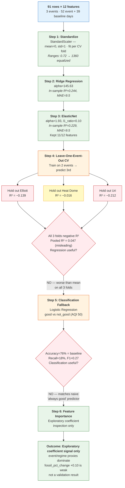
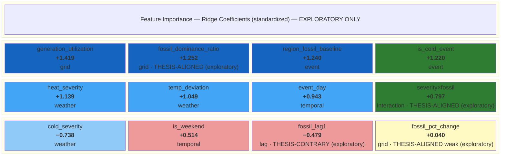
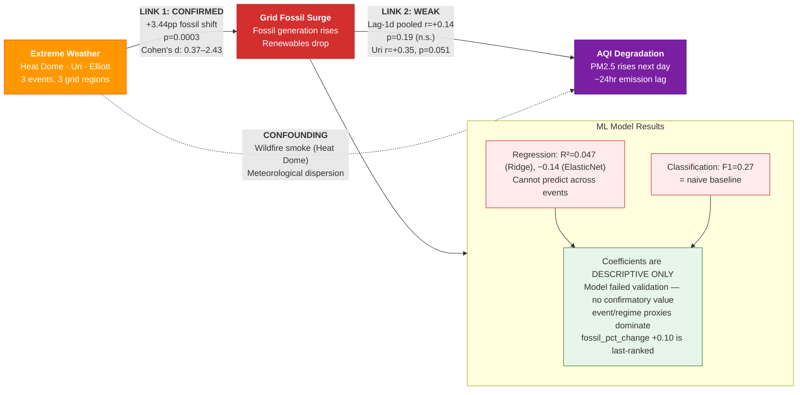

> **HISTORICAL — US Climate-AQI Thesis (FAILED)**
> This document records the original US model training attempt (Ridge/ElasticNet on 91 rows).
> The model failed cross-validation (Ridge R²=0.047, ElasticNet R²=-0.14). The project
> pivoted to Canadian Agriculture in Session 4. Preserved as Act 1 "honest failure"
> narrative for the demo.
> Current pipeline: see `docs/pipeline_architecture.md`
>
> **Reconciliation note (2026-03-19):** Numbers in this guide were reconciled against
> `data/processed/model_results.json` and `data/processed/stats_results.json` per
> reviewer critique. Earlier drafts cited stronger correlations from a pre-baseline-expansion
> statistical run; the current artifacts reflect the expanded 91-row dataset.

Model Training Guide — cp-f5g (ARCHIVED)

GOAL
Given today's weather + grid conditions, predict tomorrow's PM2.5 air quality index.
This is "Link 2" in the causal chain: fossil generation shift -> next-day AQI.

DATASET
- 91 rows (52 event days + 39 baseline days)
- 12 features across 5 groups: weather, grid, lag, temporal, interaction
- 3 events: Heat Dome (32 rows), Uri (30 rows), Elliott (29 rows)
- Primary target: pm25_aqi_next (continuous, range 16–80, mean 40.6)
- Secondary target: ozone_aqi_next
- Fallback target: aqi_category_next (binary: good/not_good, 76%/24% split)

WHY THESE MODELS

Ridge / ElasticNet (not XGBoost)
  Only 91 rows. Tree models need thousands; regularized linear models work with small data.

12 features (not 25)
  Cut from 25 to maintain 7.6:1 row-to-feature ratio. Too many features -> overfitting.

Leave-one-event-out CV (not random split)
  3 events = 3 folds. Random splitting leaks event-specific patterns.
  Holding out an entire event tests cross-event prediction — whether
  patterns learned from two events transfer to a third. This is a
  three-event regime holdout, not evidence of broad cross-region
  generalization (only 3 regions are represented).
  Note: the outer split is event-wise, but inner hyperparameter tuning
  (RidgeCV alpha, ElasticNetCV alpha/l1_ratio) uses row-wise 3-fold CV
  within the training set, not a nested event-aware split. This means
  within-event structure can still influence hyperparameter selection.
  With only 2 training events per outer fold, a fully event-aware inner
  split would leave only 1 event for tuning validation, making it
  impractical.

TRAINING PIPELINE — 6 STEPS

Step 1 — Standardize Features

  >>> WARNING — SCALING MUST HAPPEN INSIDE EACH CV FOLD <<<
  Fit the scaler on the training rows of each fold only, then transform the
  held-out fold with that same fitted scaler. Do NOT call scaler.fit() on all
  91 rows before splitting — doing so leaks held-out event statistics into
  the training transform and inflates CV scores. The implementation in
  train_model.py does manual per-fold StandardScaler fitting (fit on
  train rows, transform both train and held-out rows) rather than using
  sklearn.pipeline.Pipeline.

  Why scale at all? Ridge/ElasticNet penalize large coefficients. If
  fossil_pct_change ranges 0-25 but generation_utilization ranges 0.7-1.4,
  the model unfairly penalizes the larger-scale feature. Standardizing
  (subtract mean, divide by std) puts all features on equal footing.

Step 2 — Ridge Regression
  Linear regression + penalty that shrinks all coefficients toward zero.
  Alpha parameter controls penalty strength. Prevents overfitting by
  stopping the model from making huge coefficients to memorize noise.
  "Linear regression with a leash."

Step 3 — ElasticNet Regression
  Like Ridge but can push some coefficients all the way to zero (feature selection).
  l1_ratio controls the balance: 0.0 = pure Ridge, 1.0 = pure Lasso, 0.5 = both.

Step 4 — Cross-Validation (Leave-One-Event-Out)
  Train on 2 events, predict the 3rd, rotate 3 times:
    Fold 1: Train Uri + Elliott -> predict Heat Dome
    Fold 2: Train Uri + Heat Dome -> predict Elliott
    Fold 3: Train Elliott + Heat Dome -> predict Uri
  Tests whether patterns from two events transfer to a third (different
  event regime, region, and season). This is a three-event holdout, not
  proof of broad generalization.

Step 5 — Classification Fallback
  If regression R-squared is poor, fall back to binary prediction:
  "good" (AQI <= 50) vs "not_good" (AQI > 50).
  Logistic regression with same features. Evaluated by accuracy, precision, recall.

Step 6 — Feature Importance (Exploratory / Descriptive Only)
  Inspect Ridge coefficients to see which variables the failed model leaned on.
  These coefficient patterns are descriptive only. After cross-validation
  failure, they cannot be treated as confirmatory evidence for the thesis.
  They show what the model weighted, not what is causally true.

MERMAID DIAGRAMS


Diagram 1 — Training Pipeline & Decision Flow

Shows the 6-step pipeline with pass/fail gates and the path we actually took.




Diagram 2 — Feature Importance Ranking

Horizontal ranking of all 12 features by Ridge coefficient magnitude,
grouped by category and annotated with thesis alignment.
NOTE: All thesis-alignment annotations are descriptive only. After
cross-validation failure, coefficient direction is not confirmatory.




Diagram 3 — Causal Chain with Evidence Strength

Maps the ClimatePulse thesis with evidence from both statistical
analysis and model training.




Diagram 4 — Cross-Validation Fold Performance

Shows each fold's actual vs predicted range and R² score.

```mermaid
gantt
    title Leave-One-Event-Out — Predicted vs Actual AQI Range
    dateFormat X
    axisFormat %s

    section Elliott (held out)
    Actual range [16–68]     :a1, 16, 68
    Predicted range [40–50]  :crit, p1, 40, 50

    section Heat Dome (held out)
    Actual range [16–80]     :a2, 16, 80
    Predicted range [32–34]  :crit, p2, 32, 34

    section Uri (held out)
    Actual range [26–61]     :a3, 26, 61
    Predicted range [34–56]  :active, p3, 34, 56
```




Diagram 5 — Fold-Level Prediction Compression (cp-9q0)

Per-fold actual vs predicted summary for both models. The "Compression"
column shows how much of the actual range the model collapses — 100%
means the model outputs a single constant value (i.e., the training mean).

```
RIDGE — Fold-Level Predictions
┌─────────────┬──────────────────────────────┬──────────────────────────────┬─────────────┐
│ Held-Out    │         Actual               │         Predicted            │ Compression │
│ Event       │  Min    Max    Mean   Range   │  Min    Max    Mean   Range  │             │
├─────────────┼──────────────────────────────┼──────────────────────────────┼─────────────┤
│ Elliott     │  16.2   67.7   43.8   51.5   │  39.1   52.2   44.0   13.2  │  ██████░░░░ │
│             │                              │                              │     74%     │
├─────────────┼──────────────────────────────┼──────────────────────────────┼─────────────┤
│ Heat Dome   │  16.0   79.8   34.3   63.8   │  35.9   38.0   37.1    2.0  │  █████████░ │
│             │                              │                              │     97%     │
├─────────────┼──────────────────────────────┼──────────────────────────────┼─────────────┤
│ Uri         │  26.4   60.5   44.2   34.1   │  34.2   59.1   41.8   24.9  │  ██░░░░░░░░ │
│             │                              │                              │     27%     │
└─────────────┴──────────────────────────────┴──────────────────────────────┴─────────────┘

ELASTICNET — Fold-Level Predictions
┌─────────────┬──────────────────────────────┬──────────────────────────────┬─────────────┐
│ Held-Out    │         Actual               │         Predicted            │ Compression │
│ Event       │  Min    Max    Mean   Range   │  Min    Max    Mean   Range  │             │
├─────────────┼──────────────────────────────┼──────────────────────────────┼─────────────┤
│ Elliott     │  16.2   67.7   43.8   51.5   │  39.6   49.7   43.4   10.0  │  ████████░░ │
│             │                              │                              │     81%     │
├─────────────┼──────────────────────────────┼──────────────────────────────┼─────────────┤
│ Heat Dome   │  16.0   79.8   34.3   63.8   │  44.0   44.0   44.0    0.0  │  ██████████ │
│             │                              │                              │    100%     │
├─────────────┼──────────────────────────────┼──────────────────────────────┼─────────────┤
│ Uri         │  26.4   60.5   44.2   34.1   │  38.8   38.8   38.8    0.0  │  ██████████ │
│             │                              │                              │    100%     │
└─────────────┴──────────────────────────────┴──────────────────────────────┴─────────────┘
```

Interpretation — What Prediction Compression Means

  The compression column is the key diagnostic. When predicted range is
  much smaller than actual range, the model is "hedging" — collapsing
  toward the training-set mean rather than tracking real AQI variation.

  ElasticNet on Heat Dome and Uri: 100% compression. The model outputs a
  single constant value (the training mean, ~39-44 AQI) for every row.
  This is equivalent to predicting "I don't know, so here's the average."
  The L1 penalty drove all coefficients to near-zero, leaving only the
  intercept.

  Ridge on Heat Dome: 97% compression. Predicted range of 2.0 AQI points
  versus actual range of 63.8. The model sees variation in features but
  has learned coefficients so small that predictions barely move.

  Ridge on Uri: 27% compression — the least compressed fold. Uri has
  the strongest (but still borderline) lagged association (r=+0.35,
  p=0.051), and the model retains some predictive spread. But even
  here, the predicted range (24.9) undershoots the actual range (34.1)
  by 27%, and the fold R² is still negative (−0.212).

  Bottom line: Both models default to predicting near the global training
  mean (~40-44 AQI) rather than capturing event-specific AQI dynamics.
  This is the visual explanation for negative per-fold R² scores — the
  models literally cannot do better than "predict the average."

---

TRAINING LOG

Below are the intermediate results from each training step,
recorded during the cp-f5g walkthrough session (2026-03-18).

STEP 1 — STANDARDIZATION

  Before scaling — feature ranges vary wildly:
    severity_x_fossil_shift:  [-245.64, 1115.02]  (range=1360.66)
    fossil_pct_change:        [ -26.70,   25.08]  (range=51.78)
    generation_utilization:   [   0.73,    1.45]  (range=0.72)

  After scaling — all features centered at 0, std=1:
    severity_x_fossil_shift:  [-0.96, 2.62]
    fossil_pct_change:        [-3.84, 2.68]
    generation_utilization:   [-2.10, 2.95]

  Key insight: Without scaling, the model would essentially ignore
  generation_utilization (range 0.72) vs severity_x_fossil_shift (range 1360).


STEP 2 — RIDGE REGRESSION (in-sample)

  Best alpha: 145.63 (high = heavily regularized, cautious model)
  R² = 0.244  MAE = 9.5 AQI points  (target std = 13.1)

  Top coefficients (standardized):
    +1.419  generation_utilization      (grid stress indicator)
    +1.252  fossil_dominance_ratio      (fossil-to-renewable ratio)
    +1.240  region_fossil_baseline      (regional grid character)
    +1.220  is_cold_event               (event regime)
    +1.139  heat_severity               (weather severity)
    +0.040  fossil_pct_change           (thesis feature — weak)

  Note: In-sample R²=0.24 is the ceiling. Cross-validation will be lower.


STEP 3 — ELASTICNET (in-sample)

  Best alpha: 1.93, best l1_ratio: 0.10 (nearly pure Ridge)
  R² = 0.229  MAE = 9.5 AQI points
  Features kept: 11/12 (fossil_pct_change zeroed out by L1 penalty)

  Conclusion: ElasticNet drops the direct thesis feature (fossil_pct_change)
  entirely. The L1 penalty judges it expendable — consistent with its
  last-place Ridge coefficient (+0.040). ElasticNet overall R² is worse
  than Ridge (-0.14 vs 0.047), with Heat Dome and Uri folds strongly negative.


STEP 4 — LEAVE-ONE-EVENT-OUT CROSS-VALIDATION

  This is the primary validation test. Scaling was applied fold-internally
  (scaler fit on in-fold training rows only) to prevent held-out event
  leakage. Results:

  Ridge:
    Hold out Elliott:    R² = -0.139  MAE = 10.8  (worse than mean)
    Hold out Heat Dome:  R² = -0.016  MAE = 12.6  (worse than mean)
    Hold out Uri:        R² = -0.212  MAE =  7.8  (worse than mean)
    OVERALL:             R² =  0.047  MAE = 10.4
    Note: the positive pooled R² is an artifact of concatenating held-out
    predictions across events. Every individual fold is negative. The
    pooled score should not be read as evidence the model works.

  ElasticNet:
    Hold out Elliott:    R² = -0.070  MAE = 10.6
    Hold out Heat Dome:  R² = -0.411  MAE = 15.7
    Hold out Uri:        R² = -0.354  MAE =  8.7
    OVERALL:             R² = -0.140  MAE = 11.7

  Diagnosis: Negative R² on individual folds means the model is worse than
  just predicting the mean AQI. Predicted ranges are compressed (e.g.,
  Heat Dome predictions span 32-34 when actuals span 16-80). The model
  cannot generalize across events — each event's AQI dynamics are too
  different for 91 rows to learn transferable patterns.

  VERDICT: Regression fails cross-validation. Trigger classification fallback.


STEP 5 — CLASSIFICATION FALLBACK (good vs not_good)

  Class balance: good=69 (76%), not_good=22 (24%)
  Baseline accuracy: 76% (always predict "good")

  Leave-one-event-out results:
    Hold out Elliott:    Accuracy=66%  Precision=0%   Recall=0%   F1=0.00
    Hold out Heat Dome:  Accuracy=88%  Precision=0%   Recall=0%   F1=0.00
    Hold out Uri:        Accuracy=73%  Precision=50%  Recall=50%  F1=0.50
    OVERALL:             Accuracy=76%  Precision=50%  Recall=18%  F1=0.27

  Diagnosis: 76% accuracy = identical to always predicting "good."
  The model catches some "not_good" days in Uri (F1=0.50) but
  completely fails on Elliott and Heat Dome (F1=0.00).
  Recall=18% means it misses 82% of bad air quality days.

  VERDICT: Classification also fails to generalize across events.


STEP 6 — FEATURE IMPORTANCE (EXPLORATORY / DESCRIPTIVE ONLY)

  These coefficient patterns are descriptive only. After cross-validation
  failure, they cannot be treated as confirmatory evidence for the thesis.
  They describe what the failed model weighted, not what is causally valid.

  Ridge coefficients (standardized, ranked by absolute value):

    Feature                        Group         Coef    Thesis alignment?
    generation_utilization         grid         +1.419   —
    fossil_dominance_ratio         grid         +1.252   aligned (descriptive)
    region_fossil_baseline         event        +1.240   —
    is_cold_event                  event        +1.220   —
    heat_severity                  weather      +1.139   —
    temp_deviation                 weather      +1.049   —
    event_day                      temporal     +0.943   —
    severity_x_fossil_shift        interaction  +0.797   aligned (descriptive)
    cold_severity                  weather      -0.738   —
    is_weekend                     temporal     +0.514   —
    fossil_pct_change_lag1         lag          -0.479   contrary (descriptive)
    fossil_pct_change              grid         +0.040   aligned but weak (descriptive)

  Interpretation:
    fossil_dominance_ratio     +1.252  direction-aligned, but partly a grid-state proxy
    severity_x_fossil_shift    +0.797  direction-aligned, but exploratory only
    fossil_pct_change          +0.040  negligible direct thesis signal (zeroed by ElasticNet)
    fossil_pct_change_lag1     -0.479  contrary to the thesis direction

  Grid state and event/regime features dominate.
  Direct fossil shift (the thesis variable) ranks last among non-zero features.
  This means the model leaned on event structure, not on a transferable
  fossil-shift effect. None of these patterns can be cited as thesis validation.


OVERALL ASSESSMENT

  The model does not generalize. Cross-validation shows negative R² on all 3
  held-out events for both Ridge and ElasticNet, and the classification
  fallback matches the naive baseline.
  This is the primary result: the predictive setup fails its own validation test.

  The underlying signal is heterogeneous across events. Uri has the
  strongest lagged association (r=+0.35, p=0.051 — borderline, not
  significant at conventional thresholds) and the only non-zero
  classification F1 (0.50). Elliott and Heat Dome are weak or null
  (F1=0.00 for both). But even the Uri evidence is slim: the pooled
  lag-1 correlation is null (r=0.136, p=0.188), and the Uri-specific
  regression explains only R²=0.125. This heterogeneity makes pooled
  cross-event prediction unreliable and makes the model's failure
  unsurprising.

  Coefficient inspection is exploratory only. After cross-validation failure,
  Ridge coefficients describe what the failed model weighted — they do not
  validate the thesis. The direct thesis variable (fossil_pct_change, +0.040)
  ranks last among non-zero features and is zeroed out entirely by ElasticNet.
  Event/regime proxies dominate. These patterns cannot be cited as confirmatory
  evidence.

  This is an expected result for a small observational dataset with
  heterogeneous events. For the hackathon narrative, present the model as a
  failed generalization test, not as a source of thesis support.

  Recommendation for dashboard: Use the statistical findings (from
  stats_results.json) cautiously and event-specifically. Present the model as
  "exploratory — failed to generalize across events; coefficient patterns are
  descriptive only" rather than as a prediction or validation tool.
