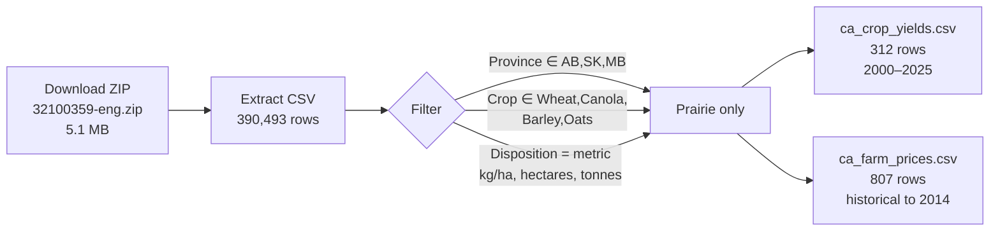
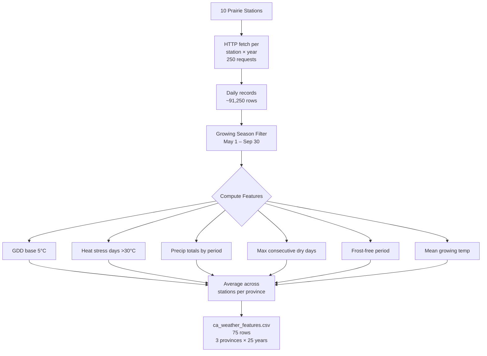
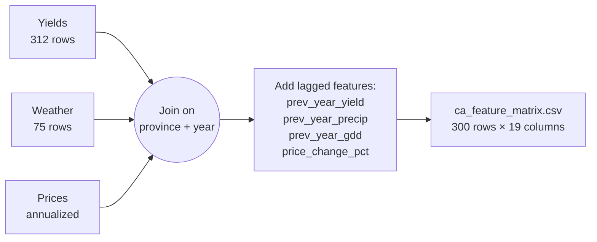

# ClimatePulse — Canadian Agriculture Pipeline Architecture

## Thesis

**Extreme Weather → Crop Failure → Economic Impact**

Prairie provinces (Alberta, Saskatchewan, Manitoba) experience drought/heat events that collapse crop yields for wheat, canola, barley, and oats. This drives commodity price spikes, insurance payouts, and GDP losses.

## Data Sources

| Source | Table/API | Grain | Coverage | Rows |
|--------|-----------|-------|----------|------|
| StatsCan 32-10-0359 | Crop yields + area + production | Province × Crop × Year | 1908–2025 | 312 (2000+) |
| StatsCan 32-10-0077 | Farm product prices | Province × Commodity × Month | 1980–2026 | 16,776 |
| ECCC Bulk Climate | Daily weather (temp, precip) | Station × Day | 2000–2024 | 250 station-years |

## Pipeline DAG

```mermaid
graph TD
    subgraph "Data Ingestion"
        SC359[StatsCan 32-10-0359<br/>Crop Yields CSV] -->|Bulk ZIP download| YIELDS[pipeline_statcan_yields.py]
        SC077[StatsCan 32-10-0077<br/>Farm Prices CSV] -->|Bulk ZIP download| PRICES[pipeline_statcan_prices.py]
        ECCC[ECCC Climate API<br/>10 Prairie Stations] -->|HTTP per station×year| WEATHER[pipeline_eccc_weather.py]
    end

    subgraph "Cleaning & Feature Engineering"
        YIELDS -->|Filter prairie provinces<br/>4 crops, metric units| YIELD_CSV[ca_crop_yields.csv<br/>312 rows]
        PRICES -->|Map commodities<br/>Annualize monthly| PRICE_CSV[ca_farm_prices_monthly.csv<br/>16,776 rows]
        WEATHER -->|Growing season aggregates<br/>Province-level average| WX_CSV[ca_weather_features.csv<br/>75 rows]
    end

    subgraph "Feature Matrix"
        YIELD_CSV --> JOIN[pipeline_feature_matrix.py]
        PRICE_CSV --> JOIN
        WX_CSV --> JOIN
        JOIN -->|Province-year join<br/>+ lagged features| MATRIX[ca_feature_matrix.csv<br/>300 rows]
    end

    subgraph "Model Training (Week 2)"
        MATRIX --> XGBOOST[XGBoost Regressor<br/>weather → yield]
        MATRIX --> PRICE_MODEL[Price Impact Model<br/>yield anomaly → price spike]
    end

    subgraph "Deployment (Week 4)"
        XGBOOST --> API1[/predict-yield]
        PRICE_MODEL --> API2[/predict-price-impact]
        API1 --> DASH[Interactive Dashboard]
        API2 --> DASH
    end
```

## Pipeline Steps — Detailed

### Step 1: StatsCan Crop Yields (`pipeline_statcan_yields.py`)



**Key fields**: `year`, `province`, `crop`, `yield_kg_ha`, `harvested_ha`, `production_mt`

### Step 2: StatsCan Farm Prices (`pipeline_statcan_prices.py`)


**Key fields**: `ref_date` (YYYY-MM), `province`, `commodity`, `price` (CAD/tonne)

### Step 3: ECCC Weather (`pipeline_eccc_weather.py`)



**Stations by province**:
- **Alberta (4)**: Calgary Intl, Edmonton Intl, Lethbridge, Medicine Hat
- **Saskatchewan (4)**: Regina Intl, Saskatoon Diefenbaker, Swift Current CDA, Indian Head CDA
- **Manitoba (2)**: Winnipeg Richardson Intl, Brandon

### Step 4: Feature Matrix Join (`pipeline_feature_matrix.py`)



**Feature list (19 columns)**:

| Category | Features |
|----------|----------|
| ID | year, province, crop |
| Target | yield_kg_ha |
| Area | harvested_ha, production_mt |
| Weather | gdd_total, heat_stress_days, precip_total_mm, precip_may_jun_mm, precip_jul_aug_mm, max_consecutive_dry_days, frost_free_days, mean_temp_growing |
| Lagged | prev_year_precip_mm, prev_year_gdd, prev_year_yield_kg_ha |
| Price | price_cad_per_tonne, price_change_pct |

## Data Quality

| Check | Result |
|-------|--------|
| Yield completeness (2000-2024) | 100% — 300/300 rows |
| Weather completeness (2000-2024) | 100% — 75/75 province-years |
| Price coverage (2015-2024) | 88% — all years, not all crop×province combos |
| Station fetch success rate | 100% — 250/250 |
| Temperature data quality | 98%+ completeness at most stations |

## 2021 Drought Validation

The 2021 Western Canadian drought is our demo climax — hold-out year for model validation.

| Province | Wheat Yield (kg/ha) | Heat Days | Precip (mm) | Dry Spell (d) | Price ($/t) |
|----------|-------------------|-----------|-------------|---------------|-------------|
| Alberta | 2,346 | 11 | 172 | 21 | $315 |
| Saskatchewan | 1,890 | 22 | 173 | 21 | $309 |
| Manitoba | 3,223 | 17 | 121 | 20 | $312 |

Compared to 2019 (normal year): Saskatchewan wheat yield dropped **44%**, heat stress days **tripled**, precipitation dropped **20%**, and dry spells **nearly doubled**.

## Running the Pipeline

```bash
# Full pipeline (order matters for join step)
python scripts/pipeline_statcan_yields.py    # ~5 sec (cached CSV)
python scripts/pipeline_statcan_prices.py    # ~5 sec (cached CSV)
python scripts/pipeline_eccc_weather.py      # ~3 min (250 HTTP fetches)
python scripts/pipeline_feature_matrix.py    # ~1 sec (joins local CSVs)
```

## Next Steps (Week 2)

1. **XGBoost training**: weather features → yield prediction (hold out 2021)
2. **Price impact model**: yield anomaly → commodity price spike
3. **Feature importance**: SHAP values for explainability
4. **Interactive dashboard**: Province map + weather parameter sliders
